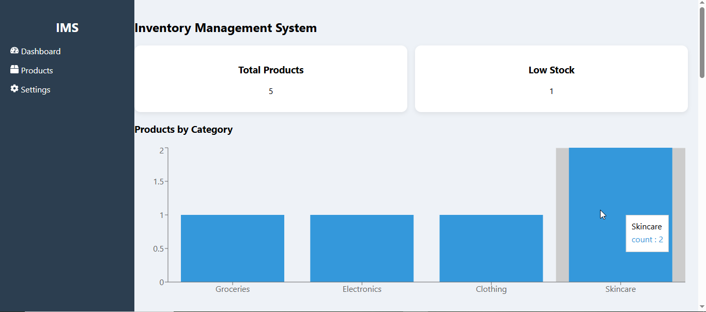
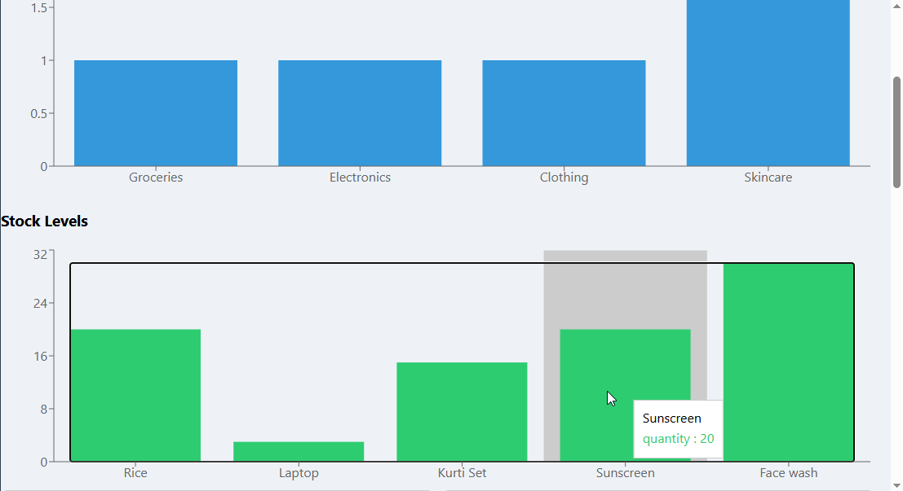
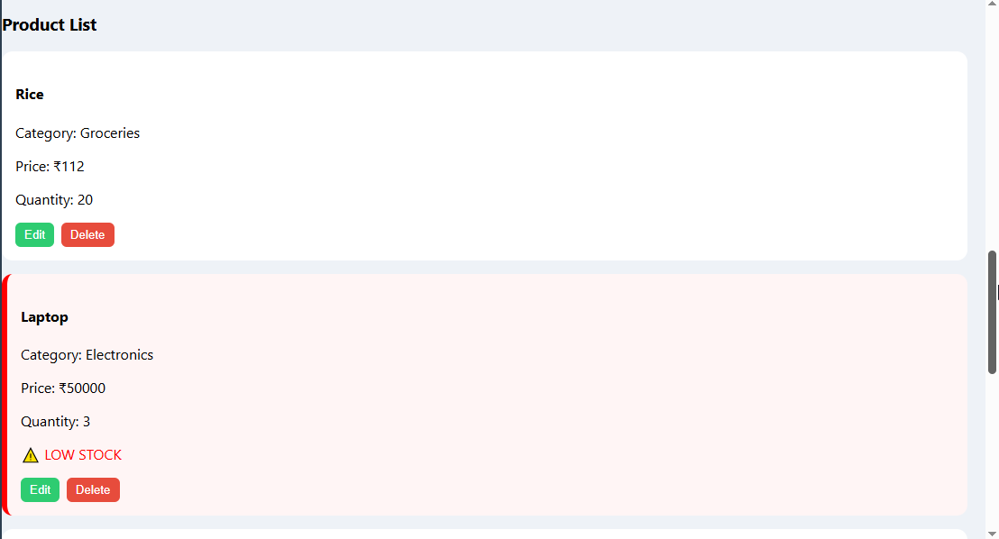
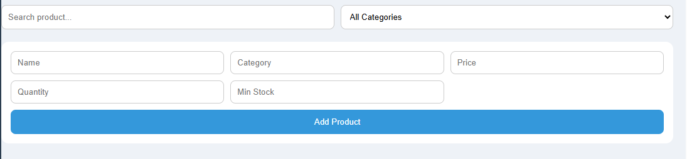

# Inventory Management System

A simple full-stack application to manage inventory and track stock levels efficiently.

## Overview

This is a full-stack Inventory Management System built using React, Node.js, Express, and MongoDB.

The application is designed to help manage products efficiently by providing features to add, update, delete, and monitor inventory levels. It also provides insights into stock availability through visual dashboards and highlights low stock items to avoid shortages.

---

## Tech Stack

Frontend:
- React (Create React App)
- Axios (for API communication)
- Recharts (for data visualization)
- CSS (custom styling)

Backend:
- Node.js
- Express.js
- MongoDB (Mongoose)

---

## Features

Product Management:
- Add new products with details like name, category, price, quantity, and minimum stock
- View all products in a structured format
- Update existing product details
- Delete products from inventory

Search and Filter:
- Search products by name in real-time
- Filter products based on category

Inventory Tracking:
- Automatically highlight low stock items
- Display total number of products
- Display number of low stock products

Data Visualization:
- Bar chart showing number of products per category
- Bar chart showing stock levels for each product

Additional Functionality:
- Input validation to prevent invalid entries
- Error handling with user-friendly messages
- Delete confirmation before removing a product
- Loading indicators during API operations
- Automatic category formatting for consistency

---

## How the Application Works

1. The frontend (React) provides the user interface where users can interact with the system.

2. When a user performs an action (add, update, delete, fetch), the frontend sends HTTP requests to the backend using Axios.

3. The backend (Node.js + Express) processes these requests through REST APIs.

4. The backend interacts with MongoDB using Mongoose to store and retrieve product data.

5. The response is sent back to the frontend and the UI updates accordingly.

6. Charts are dynamically generated based on the product data to provide visual insights.

---

inventory-system/
│
├── backend/
│ ├── models/ # Mongoose schemas
│ ├── routes/ # API routes
│ └── server.js # Entry point
│
├── frontend/
│ ├── src/
│ │ ├── components/ # Reusable React components
│ │ ├── App.js
│ │ └── App.css
│ └── public/
│
└── README.md

---

## Setup Instructions

### 1. Clone the repository

git clone https://github.com/nidhigupta08/inventory-management-system.git

---

### 2. Setup Backend

cd backend
npm install
node server.js

Ensure MongoDB is installed and running locally.

---

### 3. Setup Frontend

cd frontend
npm install
npm start

---

## Application URLs

Frontend:
http://localhost:3000

Backend:
http://localhost:5000

---

## API Endpoints

POST /api/products  
Add a new product  

GET /api/products  
Fetch all products  

PUT /api/products/:id  
Update a product  

DELETE /api/products/:id  
Delete a product  

GET /api/products/low-stock  
Fetch products with low stock  

---

## Assumptions

- MongoDB is installed and running locally
- Users provide valid inputs
- Categories are standardized automatically

---

## Possible Improvements

- User authentication and role-based access
- Pagination for handling large datasets
- Export inventory data (CSV/PDF)
- Enhanced dashboard with more analytics
- Improved UI/UX and responsiveness

---

## Author

Nidhi Gupta

---

## Summary

This project was developed to demonstrate full-stack development skills including frontend design, backend API development, database integration, and state management.

## Screenshots

### Dashboard

### Charts

### Product List

### Form
